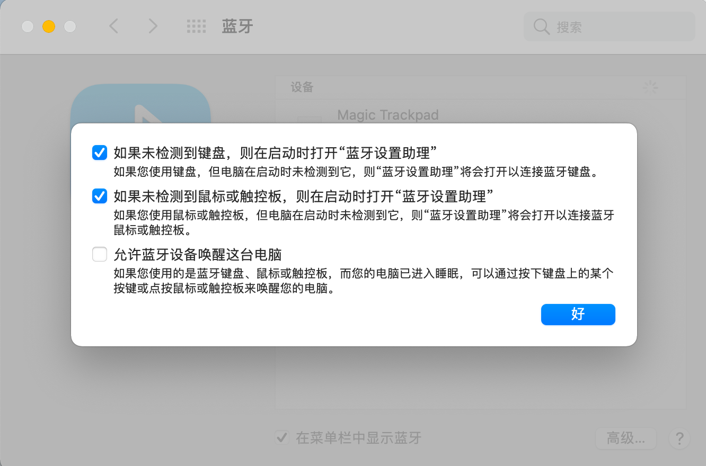

# ASRock Z390 Phantom Gaming- ITX/ac-OpenCore-Hackintosh

## 电脑配置
|规格 | 详细信息|
|:-: | :-:|
|主板型号| ASRock Z390 Phantom Gaming-ITX/ac |
|操作系统| macOS Big Sur 11.1（20C5048k） |
|处理器| 英特尔 酷睿i9 9900k |
|内存| 芝奇 16GBx2 3200Mhz C16 |
|硬盘| 西数 SN750 1T |
|显卡| XFX Radeon VII |
|显示器| 优派 VX2780-4K-ZERO |
|声卡| Realtek ALC1220 |
|网卡| 94360CS2 |

## 使用说明

### BIOS设置

- BIOS版本：V4.40C

  - Advanced \ Chipset Configuration → Vt-d : Disabled

  - Advanced \ USB Configuration → XHCI Hand-off : Enabled

  - Advanced \ Chipset Configuration → Share Memory : 128MB（使用`Pro`机型请关闭）

  - Advanced \ Chipset Configuration → IGPU Multi-Monitor : Enabled（使用`Pro`机型请关闭）
    
- 驱动 `TB3`接口支持热拔插教程

  - 刷入BIOS`V4.40C`按照下图设置 `BIOS`

   

  - 添加SSDT，`SSDT-DTPG.aml` （必须）`SSDT-TbtOnPch_PINI_D8.aml` or `SSDT-TbtOnPch_PINI.aml`

  - 打开IOJones搜索rp21 查看reg。如果是dc选用SSDT-DTPG.aml + SSDT-TbtOnPch_PINI.aml，如果是D8就选用SSDT-DTPG.aml + SSDT-TbtOnPch_PINI_D8.aml

 

  - 添加布丁`_E2C` 重命名为`XE2C`
 
  
 
  - 重启成功驱动！
  
  

  - [固定`域UUID`](https://github.com/Hush-vv/ASRock-Z390-Phantom-Gaming-ITXac-OpenCore-Hackintosh/blob/master/Docs/%E5%9B%BA%E5%AE%9A%60%E5%9F%9FUUID%60.md)

- `SSDT-XHC-USB.aml`定制USB `SSDT-XHC-TbtTypeC.aml`则是TypeC端口（需开机前插入，如果驱动了TB3无需使用）
  - 使用`SSDT-XHC-TbtTypeC.aml`时需要`ACPI`-`Delete`-`ltem1`-`Enabled`=`YES`
  
- `RadeonBoost.kext`支持下列显卡“优化”，请按需打开。`AMD RX5000系列`请自行在`boot-args`处添加`agdpmod=pikera`

  - RX 5500
  - RX 5500 XT
  - RX 5600
  - RX 5600 XT
  - RX 5700
  - RX 5700 XT
  - Radeon VII
  - RX480
  - RX580
  - RX590
  
- 其它设置
  
 
   
 
  
### `fangf`大佬的EFI
 
  - [fangf2018](https://github.com/fangf2018/ASRock-Z390-Phantom-ITX-OpenCore-Hackintosh)
  

