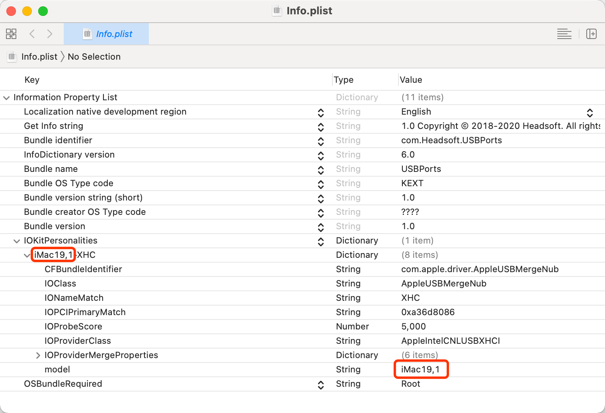
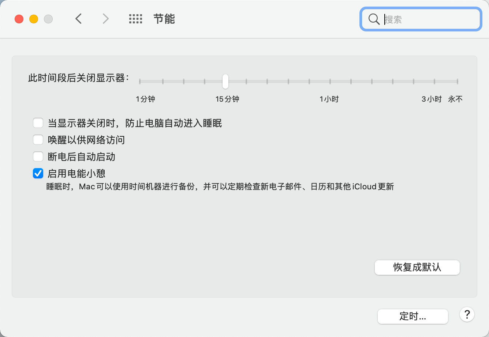
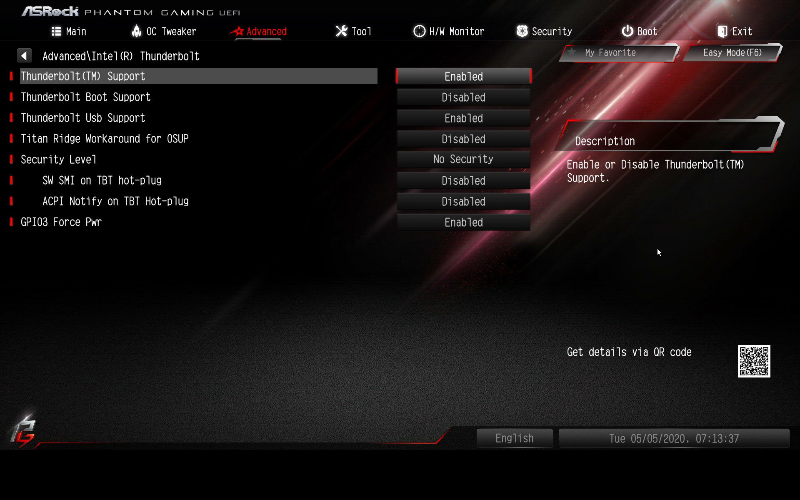
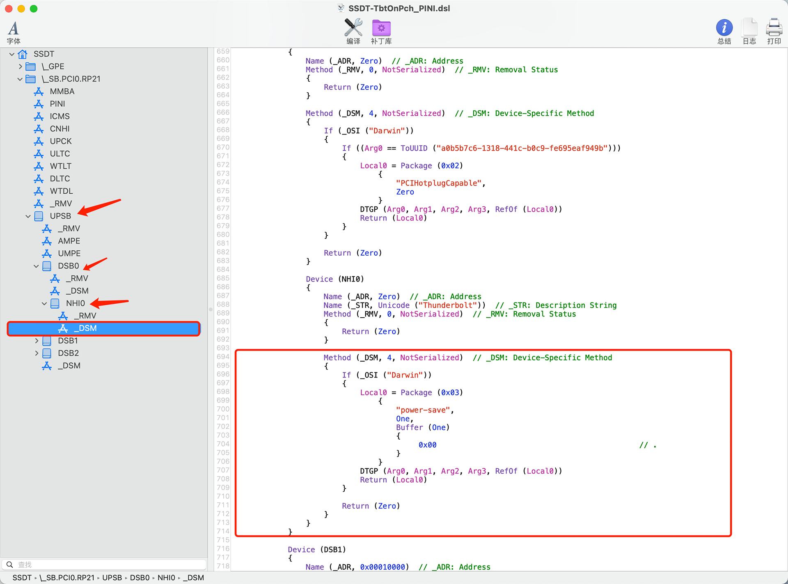

# ASRock Z390 Phantom Gaming- ITX/ac-OpenCore-Hackintosh


## 电脑配置
|规格 | 详细信息|
|:-: | :-:|
|主板型号| ASRock Z390 Phantom Gaming-ITX/ac |
|操作系统| macOS Big Sur 11.2 (20D62) |
|处理器| 英特尔 酷睿i9 9900k |
|内存| 芝奇 16GBx2 3200Mhz C16 |
|硬盘| 西数 SN750 1T |
|显卡| XFX Radeon VII |
|显示器| 优派 VX2780-4K-ZERO |
|声卡| Realtek ALC1220 |
|无线网卡| BCM943602CS |
|SMBIOS| iMac 19.1 |

## 使用说明

### BIOS设置

- BIOS版本：V4.40

  - Advanced \ Chipset Configuration → Vt-d : Disabled

  - Advanced \ USB Configuration → XHCI Hand-off : Enabled

  - Advanced \ Chipset Configuration → Share Memory : 128MB

  - Advanced \ Chipset Configuration → IGPU Multi-Monitor : Enabled
  
### 其它设置

- 已通过`USBPorts.kext`定制全部USB端口，无需重复定制。
  - 使用其它`SMBIOS`时请修改`USBPorts.kext`-`Contents`-`Info.plist`
  
  
  
- `SSDT-XHC2-TbtTypeC.aml`可将主板上的 `Thunderbolt3`接口当做`TypeC`接口使用
  - 使用`SSDT-XHC2-TbtTypeC.aml`时需要`ACPI`-`Delete`-`ltem1`-`Enabled`=`YES`
  - 驱动 `Thunderbolt3`时无需使用`SSDT-XHC2-TbtTypeC.aml`
  
 - `RadeonBoost.kext`支持下列显卡“优化”，请按需打开。`AMD RX5000系列`请自行在`boot-args`处添加`agdpmod=pikera`

   - RX 5500
   - RX 5500 XT
   - RX 5600
   - RX 5600 XT
   - RX 5700
   - RX 5700 XT
   - Radeon VII
   - RX480
   - RX580
   - RX590 
  
  
    
  
  
### 唤醒方法

- 电源键
  
### 驱动 `Thunderbolt3`接口

  - 刷入BIOS`V4.40C`按照下图设置 `Thunderbolt3` 的`BIOS`

     

  - 添加SSDT，`SSDT-DTPG.aml` （必须）`SSDT-TbtOnPch_PINI_D8.aml` or `SSDT-TbtOnPch_PINI.aml`

  - 打开IOJones搜索rp21 查看reg。如果是dc选用`SSDT-DTPG.aml `+ `SSDT-TbtOnPch_PINI.aml`，如果是D8就选用`SSDT-DTPG.aml` + `SSDT-TbtOnPch_PINI_D8.aml`

   

  - 添加布丁`_E2C` to`XE2C`
   
    
   
  - 重启成功驱动！
    
    
    
  - 如需更新`雷电`固件请参考 [华擎ASRock Z390 Phantom Gaming ITX/ac 雷电3 完美驱动 热插拔](https://fangf.cc/2020/05/19/TB3/)

  <details>
  <summary> 固定`域UUID` </summary>

  - <p>打开`系统报告`查看雷雳总线的`域UUID`将其复制替换到下面的`ToUUID ("989597F1-04F7-4D5C-95F4-30530FC5F2A6")` 中的`989597F1-04F7-4D5C-95F4-30530FC5F2A6`

  <p>

  ```sw
  Method (_DSM, 4, NotSerialized)  // _DSM: Device-Specific Method
  {
      If (_OSI ("Darwin"))
      {
          Local0 = Package ()
              {
              "ThunderboltUUID", 
              ToUUID ("989597f1-04f7-4d5c-95f4-30530fc5f2a6"), 
              "sscOffset", 
              Buffer (0x02)
              {
                   0x00, 0x00                                       // ..
              }, 

              "power-save", 
              One, 
              Buffer (One)
              {
                   0x00                                             // .
              }
          }

  ```
  </p>

  - <p> 使用`MaciASL`打开你使用的`SSDT-TbtOnPch_PINI_D8.aml` or `SSDT-TbtOnPch_PINI.aml`另存为`SSDT-TbtOnPch_PINI_D8.dsl` or `SSDT-TbtOnPch_PINI.dsl`找到`HNI0`下的这个位置 </p>

  <p>

   

  <p>
   
   - <p> 将上面替换了`域UUID`的复制进`SSDT-TbtOnPch_PINI_D8.dsl` or `SSDT-TbtOnPch_PINI.dsl`中 </p>

  <p>

    
   
   <p>
   
   - <p> 编译确认没有警告后另存为`SSDT-TbtOnPch_PINI_D8.aml` or `SSDT-TbtOnPch_PINI.aml`然后放入`EFI`中加载。这样每次启动后`域UUID`值就不会改变了</p>
  </details>
  
## OpenCore  Mod

- ACPI补丁可设置全局还是只对于MACOS生效，将ACPI-> Quirks-> EnableForAll设置为yes为全局影响（默认为no）

- 引导程序Quirks修改为仅适用于macOS，而不影响其他非MACOS系统。
  
## 感谢
 
 -  @宪武 大佬
 - [fangf2018](https://github.com/fangf2018/ASRock-Z390-Phantom-ITX-OpenCore-Hackintosh)
 - @btwise  
 - [OC-little](https://github.com/daliansky/OC-little)的所有贡献者
